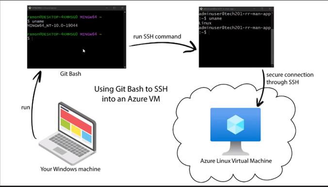

# Linux

To run linux you have to start the virtual machine.
Ubuntu is like a flavour of Linux. 

## What is Git Bash?

Git Bash is like an emulation / translator for windows so it understands linux commands. It is running a version of GNU. Bourne Again SHell (Bash). A shell is software that is an interface which can run commands. There are multiple shells. 
 `cat /etc/shells`
Shows all the shells.

## Why learn linux?

- Fast growing - becoming more popular for desktop use
- Stable - Doesnt need to be restarted all the time
- Scales well - scientific, engineering
- More employable 

## What is linux?

A clone of Unix which was used on large main frames and linux can be run on smaller machines. Made up of a kernal - core operanting system. Many libraries and systems rely on this. 

## Helpful commands:

<command> --help -> Will give you more information on the command
uname -> gives the OS
uname -p -> processor
uname -n -> hostname
uname -a -> all of the information  

| Command   | Description                                                        |
|-----------|--------------------------------------------------------------------|
| `ls`      | Lists files and directories in the current directory.              |
| `cd`      | Changes the current directory.                                     |
| `pwd`     | Prints the current working directory.                              |
| `mkdir`   | Creates a new directory.                                           |
| `rm`      | Removes files and directories.                                     |
| `cp`      | Copies files and directories.                                      |
| `mv`      | Moves or renames files and directories.                            |
| `cat`     | Concatenates and displays the contents of files.                   |
| `grep`    | Searches for patterns in files.                                    |
| `chmod`   | Changes permissions of files and directories.                      |
| `chown`   | Changes the owner of files and directories.                        |
| `chgrp`   | Changes the group ownership of files and directories.              |
| `ssh`     | Connects to a remote server using the Secure Shell (SSH) protocol. |
| `ps`      | Lists currently running processes.                                 |
| `sudo`    | Executes a command with superuser (administrative) privileges.     |
| `history` | Lists the command history.                                         |
| `exit`    | Exits the current shell or terminal.                               |
| `uname`   | Prints system information.                                         |
| `nano`    | A text editor                                                      |
| `touch`   | Creates an empty file                                              |
| `printenv`| Prints the enviroment variables                                    |
| `echo`    | Prints a file or string                                            |
| `export`  | Creates an enviroment variable                                     |
| `source`  | Used to reload the .bashrc file                                    |

History gives a list of all the commands you have used and they are numbered. They you can use the command !<number> and it will be the command.

rm -r -> Removes directories and everything within them.

## Navigate files and folders

- one dot means current directory (cd .)
- two dots means the parent directory (cd ..)
- home directory (cd OR cd ~)
- present working directory (pwd)
- root folder starts with a slash /  (cd /)
- your home directory is the user folder (adminuser)

Not every user gets a folder in the home directory. The super user / root user has a folder in the root directory. 

File and folder names **are** case sensitive.

## Managing file ownership

Mangaging file ownership is important as you need to keep track of who has the correct permissions to certain files and directories. To view file ownership the command is ls -la (l for long and a for all).

The file or directory created by a user typically belongs to that user. The owner of a file or directory is determined by the user who creates it. The group ownership of the file or directory is usually set to the primary group of the user. This can vary depending on the system's configuration, such as whether it uses user private groups or assigns a different group ownership.

The permissions of a new file / directory is set by the unmask permissions? The default execute (x) permission is excluded for the owner when creating a file due to security reasons. Users can still grant the execute permission with the `chomd` command. 

## File permissions

- Owner / User - **U** - The Owner permissions apply only the owner of the file or directory, they will not impact the actions of other users.
- Group - **G** - The Group permissions apply only to the group that has been assigned to the file or directory, they will not effect the actions of other users.
- Others - **O** - The All Users permissions apply to all other users on the system, this is the permission group that you want to watch the most.

| Number | Permission Type          | Symbol |
|--------|--------------------------|--------|
| 0      | No Permission            | —      |
| 1      | Execute                  | –x     |
| 2      | Write                    | -w-    |
| 3      | Execute + Write          | -wx    |
| 4      | Read                     | r–     |
| 5      | Read + Execute           | r-x    |
| 6      | Read + Write             | rw-    |
| 7      | Read + Write + Execute   | rwx    |

Example:

-rw-r--r-- 1 user wheel   0 Feb 16 14:22 file2

-(rw-) (r--) (r--) 1 user wheel   0 Feb 16 14:22 file2

(**u**ser)  (**g**roup)  (**o**thers)

- The owner has read and write permissions
- The group and others only have read permissions
- This code would be 644
- This is a file as it doesnt start with a d
  
### chmod command

You can use chmod to change file permissions.

chmod <what permissions / code> <file_name>

Examples:

- $ chmod u+x file_name
- $ chmod g+rw file_name
- $ chmod o-w file_name
- $ chmod u=rwx,g=rx,o= file_name
- $ chmod 774 file_name

Chown

## Notes for 22/06/2023

Pipe symbol | takes the output and gives it to another command
grep searches for a thing like a key word.
apt also apt-get use to install packages
sudo command is like superuser / root user command

### Important commands used today

`cat chicken-joke.txt | grep chicken` Takes the chicken-joke text file and searches for the key word **chicken** and it gives you all the lines with chicken on it.

`sudo apt install tree`
installed library called tree which shows files in a nicer way

`sudo apt update -y`
update all sources so it can find the packages -y means say yes to everything

Root `cd /` it is like the base level of the folders

`cp chicken-joke.txt bad-joke.txt` Copy the chicken joke and give the copy the name bad-joke

`mv bad-joke.txt ~` Move the bad-joke file to the home directory

`rm -r` Remove everything within the folder **recursive**

## Scripting

Provision ngenx

`touch provision.sh` - create empty file
`nano provision.sh` - edit file

#! is the way to tell linux this is the path to take. We want Bash.

So inside the file type:

`#!/bin/bash`

Two git bashes open - one to manually test and one to add to the script.

    #!/bin/bash

    # update
    sudo apt update -y

    # upgrade
    sudo apt upgrade -y

    # install nginx
    sudo apt install nginx -y

    sudo systemctl status nginx

    # restart nginx
    sudo systemctl restart nginx
    # enable nginx - make sure that when the virtual machine restarts nginx will automatically start

    sudo systemctl enable nginx

## Environment variables

- value stored in memory 
- accessible by other tools Linux

`printenv` shows all the environment variables. They are capitilised. 
`printenv USER`

### Make a variable
`MYNAME=elena`
`echo $MYNAME`

### Make an environment variable and .bashrc
`export MYNAME=elena`
`printenv MYNAME`

To have an enviroment variable that will stay when you log out and back in you need a file called `.bashrc`. It needs to be edited. 

`nano .bashrc` -> edit the file

Go to the bottom of the file and add the variable

`export CATSNAME=Iggy`

Go out of the file and use the command

`source .bashrc` -> this will reload the file and the new enviroment variable will be present

### Remove an environment variable
`unset MYNAME`

## Processes

2 types:

1. System proceses - ps aux
2. User Processes - ps

`ps` shows user processes

If your CPU has one core it can handle one process at a time. If it is multicore it can run more than one process at a time. The operating system (OS) has to prioritise what needs to run first.

PID is process ID - Every process has one.
The parent process starts the child process.
- TTY is the terminal if there is a ? then it is a system proccess.

`ps aux` - Shows all processes in detail.